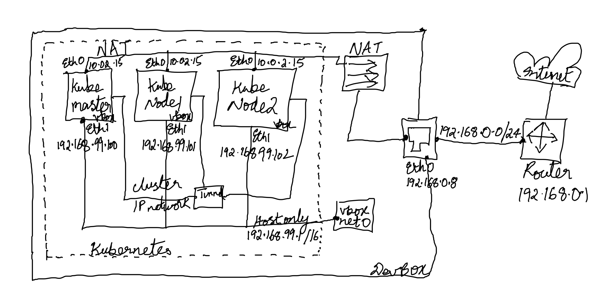

# Preconditions

- Needed ONLY if you want to set up kubernetes multi node (single control-plane cluster i.e. one master node) from scratch using kubeadm (Otherwise minikube is good enough for most purposes if your focus is on deploying applications to kube and NOT administration). See how to [minikube](https://vimeo.com/205127936) , which is already in the parent readme index
- Frankly if you are not into devops/infra admin, this is overkill and not a good investment of your time, especially given there are so many managed kubernetes deployment like EKS, GCP, Azure and so many more options with Kops,Ansible etc.
- Then why am I doing this ? My mind works better when I set up things from scratch at least once
- Assuming you have basic knowledge of hypervisor(s) i.e. virtual machines with VMware, virtualbox or similar. Also vagrant, which is command line way of upping vm's
- I tried with Ubuntu16.06 and Centos7.5 , and each folder contains scripts that match that OS

# Network Diagram
  

- My home router has cidr `192.168.0.1/16` hence my dev box had ip `192.168.0.8` via interface eth0 to home router LAN
- Virtualbox when installed provides various network interface types (host-only, bridget, NAT etc.). Out of the box, it provides four host-only software routers, with different cidr's (e.g. vboxnet0: 192.168.99.1/16, vboxnet1:192.168.33.1/16 with two additional vboxnet2 & 3). Open virtualbox menu > File > Host Network manager and check with ones are enabled/disabled. Think of each network as a router and that helps with visualization
- Host-only network means, that any virtualbox instance that has an ip assigned via `enabled` vboxnet* network, will be accessible from the host machine (in this case my dev box that has ip 192.168.0.8). Outside of this box, the virtualbox instances cannot be accessed
- kubemaster, kubenode1, kubenode2 have been assigned static ips via eth1 into vboxnet0 host-only network (We use this for kubernetes --api-advertise-address for `kubeadm init`). For --pod-network value when using kubeadm init, we can use any private address cidr (in my case I used 192.168.99.1/16. I could have used any other 192.168.110.1/16 etc.)
- All virtualbox nodes (kubemaster, kubenode1, kubenode2) are NATed via eth0 to access internet outbound (and that goes via the dev box network, attached to my home lan network, that reached out to internet). The nat comes by default whenever we spin up a virtual box. All nodes get the same IP (10.0.2.15) , which is okay because it is used only for outbound internet i.e. inbound access to any nodes through NAT is impossible
- The kubernetes cluster itself (after kubeadm init is successful), creates it own internal cluster IP network(through tunneling) and we don't have to do anything there

# Gotchas
- I was setting this up at home and my wifi router ip was 192.168.0.x (Ensure that you do NOT select cidr similar to that range, when setting hostonly ips in Vagrantfile). I probably lost an entire week not understanding why kubernetes was not coming up, the root cause was because my hostonly ip within vm was also 192.168.0.x , which was conflicting with my host machine's ip
- After `vagrant up` - probably have to ssh into each machine and set the static ip manually (I was using sed to write, somehow it was working, will revisit this later and code it off in the bootstrap script). For example ensure you replace `127.0.0.1   kubemaster   kubemaster` with `192.168.99.100  kubemaster`. Likewise for kubenode1 and kubenode2
- Also after upping the cluster `kubectl get nodes -o wide` shows internal-ips to be the same for all nodes. Somehow kubeadm is picking up the NAT address , and since it is the same for all nodes, all get assigned the same. To fix this I had to manually open the file `/var/lib/kubelet/kubeadm-flags.env` and add the node-ips for kubemaster, kubenode1 & kubenode2 as - `KUBELET_KUBEADM_ARGS="--node-ip=192.168.99.100 --cgroup-driver=cgroupfs --network-plugin=cni --pod-infra-container-image=k8s.gcr.io/pause:3.1"`
- If you have set up docker swarm in the past (I used docker-machine and vagrant, but docker-machine rocks with ease of use, the only problem is that it locks you up with busybox image and does not let us choose ubuntu/centos etc.), then kubernetes set up aligns mostly , especially around upping the master and then joining the nodes using token and discovery token. [Docker Swarm refresher](https://vimeo.com/189520997)

# How it works

- Once you have your infra layer set up with Vagrant and prepared each of your nodes (i.e. Vagrant.bootstrap.sh ran successfully getting all packages), its time to spin up a Kubernetes cluster
- Look into the script `create_master.sh` and `create_node.sh` - I would encourage to take each line and manually execute it , so that we can appreciate and sink in how the system is spun up with layers and mentally form a map. The map becomes your navigation and `confidence/comfort` as you get into advanced concepts of using kubernetes
- The overall flow that mentally sits in my mind after executing this and making it work for days is as below
    - Prepare Infra layer with vagrant - have hostonly and NAT network configured for each node. Ensure that your hostonly network cidr doesn't collide with other network namespaces for e.g. your host on which you launch vagrant
    - Identify your network cidr upfront and ensure to edit your pod network bootstrap aligns with that cidr (in my case calico.yml)
    - Create single-plane K8S cluster using kubeadm by following the link in References section, follow the instructions that kubeadm gives like copying config to be able to use kubectl as normal user, command to join the kubecluster with join-token and discovery-token-ca-cert-hash
    - Install a network for e.g. calico using the instructions (Do this before joining any node to the cluster)
    - Verify that calico network comes up fine
    - Join other nodes to the cluster and verify pods and node status come up healthy

# References
Below links are what I used as authoritative guidance (in addition to all of the debugging articles by various contributors online either through their blogs or content collation networks like stackoverflow, stackshare etc. )

- [Install KubeAdm](https://kubernetes.io/docs/setup/production-environment/tools/kubeadm/install-kubeadm/)